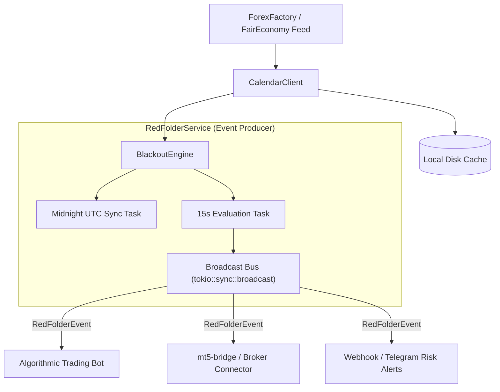

# 🔴 redfolder

[](https://crates.io/crates/redfolder)
[](https://docs.rs/redfolder)
[](https://github.com/0xbarss/redfolder/actions/workflows/ci.yml)
[](LICENSE)

An asynchronous, event-driven economic calendar client and automated trading blackout engine written in pure Rust.

In quantitative finance and retail forex trading, high-impact macroeconomic releases (CPI, NFP, FOMC, Rate Decisions) are universally known as **"Red Folder"** events. These releases trigger severe volatility spikes, spread blowouts, and liquidity vacuums. Major prop trading firms (such as **FTMO, FundedNext, and The5ers**) strictly penalize or breach accounts that execute orders during these windows.

`redfolder` monitors real-time macroeconomic feeds, calculates dynamic trading blackout windows, and emits typed events to safeguard your algorithmic trading bots and execution bridges.

---

## ⚡ Key Features

- **📡 ForexFactory / FairEconomy Integration**: Directly ingests weekly economic calendar releases with automatic local disk caching and offline fallback.
- **⚡ Fully Event-Driven Architecture**: Emits discrete domain events (`BlackoutWarning`, `BlackoutStarted`, `BlackoutEnded`, `CalendarUpdated`) via Tokio broadcast channels and worker streams.
- **⚠️ Pre-Blackout Advance Warnings**: Configurable heads-up alerts (e.g. 5 minutes before blackout start) to gracefully cancel pending limit orders and tighten stops *before* spreads blow out.
- **🛡️ Dynamic Window Merging**: Automatically clusters and merges closely spaced releases (e.g., CPI followed 30 minutes later by FOMC) into a single cohesive blackout period.
- **🛑 Weekend Market Close Curfew**: Built-in Friday evening market close curfew with both `short` (Friday evening session) and `weekend` (Friday through Monday 00:00 UTC) modes.
- **🤖 Multi-Worker Isolation**: Register multiple trading pairs or strategies with distinct currency lists, impact thresholds, and timing buffers.
- **🖥️ Standalone CLI Tool**: Monitor blackout statuses, query upcoming events, or run a live countdown directly in your terminal.

---

## 🏗️ Architecture



---

## 📦 Installation

Add `redfolder` to your `Cargo.toml`:

```toml
[dependencies]
redfolder = "0.1"
tokio = { version = "1", features = ["full"] }
```

To install the CLI binary:

```bash
cargo install redfolder
```

---

## 🚀 Quickstart

### 1. Simple Synchronous / One-Shot Blackout Check

```rust
use redfolder::calendar::CalendarClient;
use redfolder::config::RedFolderConfig;
use redfolder::engine::BlackoutEngine;

#[tokio::main]
async fn main() -> Result<(), Box<dyn std::error::Error>> {
    // Fetch economic releases (with automatic local disk caching)
    let client = CalendarClient::new(None);
    let events = client.fetch_or_cached().await?;

    // Build configuration: High-impact USD events, 30 min before/after
    let config = RedFolderConfig::builder()
        .currencies(vec!["USD"])
        .impacts(vec!["High"])
        .buffer_minutes(30, 30)
        .build();

    let engine = BlackoutEngine::compile(&events, &[&config], chrono::Utc::now());

    if engine.is_blackout(&config) {
        let current = engine.current_window(&config).unwrap();
        println!("🔴 Blackout Active: {} (ends in {}m)", current.summary_title(), current.remaining_minutes());
    } else {
        println!("🟢 Trading Permitted: No active blackout for USD.");
    }

    Ok(())
}
```

---

### 2. Event-Driven Bot Integration

Subscribe to the event stream in your trading engine to respond to pre-event warnings and blackout state transitions:

```rust
use redfolder::prelude::*;
use std::time::Duration;

#[tokio::main]
async fn main() -> Result<(), Box<dyn std::error::Error>> {
    let service = RedFolderService::new(None);

    let config = RedFolderConfig::builder()
        .currencies(vec!["USD", "EUR"])
        .impacts(vec!["High"])
        .buffer_minutes(15, 15)
        .warning_minutes(5) // 5-minute pre-event heads-up alert
        .build();

    // Register worker and receive typed event stream
    let mut events = service.register_worker_events("eurusd_bot", config).await;
    service.start().await?;

    while let Some(event) = events.recv().await {
        match event {
            RedFolderEvent::BlackoutWarning { window, minutes_until_start, .. } => {
                println!("⚠️ WARNING: '{}' starts in {}m. Cancelling pending limit orders...", 
                    window.summary_title(), minutes_until_start);
            }
            RedFolderEvent::BlackoutStarted { window, .. } => {
                println!("🚨 BLACKOUT ACTIVE: {}. Halting strategy execution.", window.summary_title());
            }
            RedFolderEvent::BlackoutEnded { .. } => {
                println!("🟢 BLACKOUT CLEARED: Resuming automated trading.");
            }
            _ => {}
        }
    }

    Ok(())
}
```

---

### 3. Prop Firm Rules Preset

Prop firms like **FTMO** mandate strict 5-minute pre/post high-impact news restrictions and weekend market close curfews:

```rust
use redfolder::config::RedFolderConfig;

// Preconfigured for FTMO / FundedNext / The5ers:
// - 8 major currencies (USD, EUR, GBP, JPY, CAD, AUD, NZD, CHF)
// - High-impact (Red Folder) releases only
// - 5-minute buffer before & after
// - Weekend market close curfew until Monday 00:00 UTC
let prop_firm_config = RedFolderConfig::prop_firm_strict();
```

---

## 🖥️ Command-Line Interface (CLI)

`redfolder` includes a high-performance terminal utility:

### Check Current Status
```bash
# Check if USD is currently in a blackout window
redfolder status --currency USD

# Output as JSON (ideal for shell scripts or webhooks)
redfolder status --currency USD --json
```

### Inspect Upcoming Blackouts
```bash
# View blackout windows scheduled for the next 24 hours
redfolder upcoming --hours 24 --currency USD --impact High
```

### Live Terminal Watcher
```bash
# Monitor status with a real-time countdown
redfolder watch --currency USD --interval 5
```

### Sync Calendar Cache
```bash
# Force refresh calendar data from ForexFactory to local disk cache
redfolder sync
```

---

## 🤝 Synergy with `mt5-bridge`

`redfolder` pairs naturally with [`mt5-bridge`](https://github.com/0xbarss/mt5-bridge) to build institutional-grade automated trading systems:

```rust
// In your trading loop:
tokio::select! {
    // 1. Process broker tick feed from mt5-bridge
    Some(tick) = mt5_client.next_tick() => {
        if !redfolder_service.is_blackout("scalper").await {
            strategy.on_tick(tick);
        }
    }
    // 2. React to RedFolder risk events
    Some(event) = redfolder_events.recv() => {
        match event {
            RedFolderEvent::BlackoutWarning { .. } => {
                mt5_client.cancel_all_orders().await?;
            }
            RedFolderEvent::BlackoutStarted { .. } => {
                mt5_client.close_all_positions().await?;
            }
            RedFolderEvent::BlackoutEnded { .. } => {
                strategy.reset();
            }
            _ => {}
        }
    }
}
```

---

## 📄 License

This project is licensed under the [MIT License](LICENSE).
